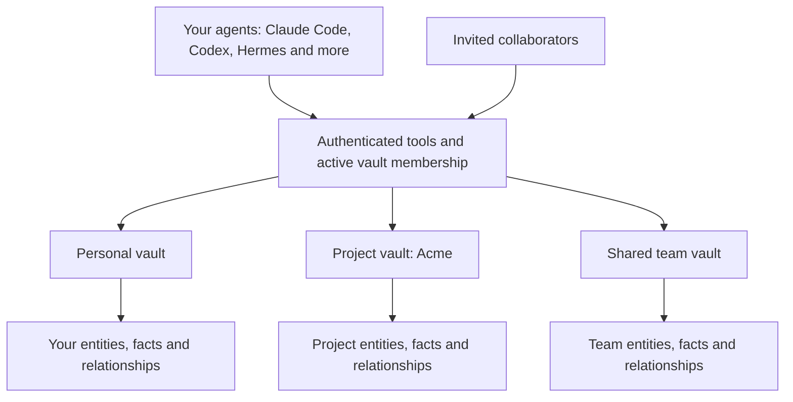

<div align="center">

# Eunomia

```bash
curl -fsSL https://midhunkumar05.github.io/eunomia/install.sh | bash
```

**Vaults for persistent, shared AI memory.**

Give each project, client or team its own memory vault. Keep its people,
facts and decisions together, share it with collaborators, and let your
agents pick up that context across sessions.

[](https://github.com/Qyrhal/Eunomia/actions/workflows/ci.yml)
[](https://github.com/Qyrhal/Eunomia/releases/latest)
[](LICENSE)


[Vaults](#vaults-are-the-core) · [Get started](#get-started) · [How it works](#how-it-works) · [Connect an agent](docs/agents.md) · [Documentation](docs/README.md)

</div>

## Why Eunomia?

An agent's conversation ends; the things it learned should stay useful.
Eunomia is a self-hosted memory service built around **vaults**: separate
spaces for the knowledge your agents read and update over MCP or REST.
Each vault holds its own entities, memories and relationships, with access
controlled by membership.

- **Choose the memory scope.** Use a personal vault or a named project/team vault; share access through invitations.
- **Remember across sessions.** Save facts and experiences about people, organisations, locations and code.
- **Find context in several ways.** Recall combines semantic search, keywords, memory text, graph links and explicit date ranges.
- **Bring in your apps.** Sync records from 12 built-in sources, then search them alongside remembered facts.
- **Run it for a team.** Each org gets its own database, and tokens can be scoped, limited to one vault and set to expire.
- **See what's stored.** Explore entity and code graphs, inspect memories, or compare vaults in a 3D vector cloud.

## Vaults are the core

A vault is the unit of organisation and sharing in Eunomia. Keep a client's
facts, a project's decisions or a team's working knowledge in its own vault.
The same person or repository can appear in several vaults, with different
memories and relationships in each.



| Vault operation | What it gives you |
|---|---|
| **Create** | A named space for a project, client, team or service; your personal vault is created with your account |
| **Share** | Invite collaborators with owner/member roles; access begins when an invitation is accepted |
| **Scope** | Pass a vault name or ID as `vault_id` to target its memory; membership is checked on every read and write |
| **Clone** | Copy a vault's entities, memories and relationships into a new vault you own |
| **Merge** | Combine two vaults into a new one, folding matching entities and deduplicating facts and relations; both originals stay intact |

**Writes go to your personal vault by default.** Name a vault to write into
its project or team context. Without `vault_id`, `recall`, `reflect` and
`entities_search` search your personal vault plus the project/team vaults
you belong to. Recall hits identify their vault; an explicit vault narrows
the search. Another user's shared personal vault is searched only when named.

Sharing a vault shares its memory graph. Raw synced connector records remain
owned by the user who connected the source. Removing a member or leaving a
vault takes effect on the next call. A token limited to one vault uses that
vault as its default and cannot reach any other.

Vaults live inside an org. A self-hosted install is one org by default, so
everyone who signs up can be invited to its vaults; each org's data sits in
its own database.

Explore [vault concepts](docs/concepts.md#vaults) and the
[source-linked vault architecture](docs/architecture.md#vaults-define-the-memory-boundary).

## Get started

Use Linux or macOS, or WSL on Windows. The installer checks for git, Docker
with Compose, and other prerequisites, and offers to install missing tools.

It starts the database, backend and web app, sets up updates and nightly
backups, creates your account, and connects supported agents. Open
[localhost:3000](http://localhost:3000), sign in, then restart your agent so
it loads the MCP server.

Try asking it:

> Create a vault called Acme. In Acme, remember that Ada prefers async updates over meetings.

Then, in another session:

> In the Acme vault, what do you know about Ada?

**No model key is required for agent-written memory or text/graph recall.**
Your connected agent uses its own model. To enable semantic search, automatic
entity extraction, observation synthesis and in-app chat, configure an
OpenAI-compatible endpoint in Settings. Auth-free self-hosted endpoints can
work without a key; embeddings must return 1,536-dimensional vectors.

See [Quickstart](docs/quickstart.md) for the first run and
[Installation](docs/installation.md) for manual setup and installer options.

### Upgrading from 1.x

2.0 moves to SurrealDB 3.3 and gives each org its own database. Update to
the 1.4.2 bridge release first, then to 2.0, with **Update now** in Settings
(instance admins only). The bridge installs the upgrade hook that 2.0 needs.

During the update Eunomia takes an encrypted `pre-v3` backup, copies your
data to a new SurrealDB 3 volume, checks every table's row count, and rolls
back to the old volume if anything doesn't match. On its first boot, 2.0 then
moves the single database into one org, verified the same way; the old
database is kept until you remove it. The app is offline while this runs;
plan for about four times your current data volume in free disk.

Keep `ENCRYPTION_KEY`: it now also protects each org's database password. If an
install skipped the bridge and SurrealDB won't start, run
`bash scripts/upgrade-surreal-v3.sh` from the install folder. See
[Upgrading to SurrealDB 3](docs/upgrading-to-surrealdb-3.md) and
[Org databases and the one-time move](docs/deployment.md#org-databases-and-the-one-time-move).

## How it works


[Explore the interactive architecture](docs/diagrams/architecture.html)
(download and open locally) · [Read the underlying workings](docs/architecture.md)

1. **Choose a vault.** Agents write into your personal vault or a named project/team vault, with membership checked before access.
2. **Collect.** Sync jobs, queued on each source's schedule or by **Sync now**, and supported webhooks map app data into a common record format.
3. **Store and enrich.** Records and links are upserted into the org's database. When a model is configured, records are embedded, and background jobs extract entities and facts and consolidate observations.
4. **Recall.** Five retrieval paths produce candidates. Reciprocal Rank Fusion combines their ranks; recency and agreement between paths adjust the results.
5. **Use.** Agents, REST clients and in-app chat call one shared tool registry to recall, reflect, write memories and manage graphs and vaults.

Records and memories are distinct: synced records belong to a user; memories
belong to a vault. Sharing a vault shares its memories, without sharing a
member's raw connector data. The code graph is populated by agent calls to
`code_entity_upsert` and `code_relate`.

Each org's data lives in its own SurrealDB database, reached through that
org's own database user, so a query for one org cannot read another's.
Accounts, tokens, the audit trail and the job queue live in a separate
`control` database. Background work runs as leased jobs with retries, so a
job from a crashed worker is picked up again.

## Connect your agents and apps

The installer supports Claude Code, Codex, Hermes, Gemini CLI, Cursor,
Windsurf, OpenCode, VS Code and Claude Desktop. To connect more agents later:

```bash
./scripts/connect-agents.sh
```

The MCP endpoint is `<your Eunomia URL>/mcp`. Agents authenticate with a
personal access token, which can be scoped, limited to one vault and set to
expire, or sign in through MCP OAuth 2.1. REST clients use the same token with
`POST /api/tools/:name`. Browser sessions use signed cookies. Mutating tool
calls are audit-logged. See [AI agents & MCP](docs/agents.md) for
configuration and the complete tool list.

| Source | Data you can bring in |
|---|---|
| Up Bank, Stripe | Banking and payment records |
| HeyPocket | Meeting recordings and transcripts |
| GitHub, Linear, Notion, Todoist | Issues, pull requests, documents and tasks |
| Slack, Discord, Gmail, Google Calendar | Messages, mail and calendar events |
| Spotify | Listening history |

Set credentials and source options on the Connectors page. Connector secrets
are encrypted at rest with AES-256-GCM. Up Bank supports signed webhooks;
other sources use their sync adapters. A synthetic demo source is available
for on-demand test data. See [Connectors](docs/connectors.md) for setup details.

## Develop locally

You need Rust, Bun and Docker. From the repository root, create `.env` if it
doesn't already exist:

```bash
cp .env.example .env
openssl rand -base64 32
```

Put the generated value in `ENCRYPTION_KEY`. Set a stable `JWT_SECRET` too
if you want browser sessions to survive backend restarts. Then run:

```bash
./run.sh
```

This starts SurrealDB 3.3.1 in Docker, the Rust backend on `:8001`, and Next.js
on `:3000`. The frontend proxies `/api/*` and `/mcp` to the backend. A dev
volume last used with SurrealDB 2.x must be removed or upgraded first.
The Compose stack uses prebuilt images; see [Installation](docs/installation.md)
for that path.

Run checks from the repository root:

```bash
(cd backend && cargo test --release)
bash scripts/tests/connect-agents.test.sh
bash scripts/tests/auto-update.test.sh
bash scripts/tests/https.test.sh
(cd frontend && bun run lint && bun run build && bunx tsc --noEmit)
```

With the stack running and system Chrome installed:

```bash
(cd frontend && E2E_BASE_URL=http://localhost:3000 bun run test)
```

[CI](.github/workflows/ci.yml) runs clippy and the backend tests (also under
the hardened SurrealDB settings, plus the org isolation proof), every script
test, the frontend checks, Playwright against the Compose stack built from
the repository with SurrealDB 3.3.1, the 2.x to 3.3 upgrade, and restore
drills. The [recall evaluation](frontend/tests/recall-eval.spec.ts) measures
Recall@5 and MRR on a fixed corpus, and checks for cross-vault and cross-user
leaks. See [Testing](docs/testing.md) for every layer.

Errors carry a stable code and a trace id (RFC 9457 problem+json); logs are
JSON, and OpenTelemetry export is optional. `eunomia-backend replay <trace_id>`
re-runs a recorded failure. See [Errors](docs/errors.md),
[Debugging](docs/debugging.md) and [Observability](docs/observability.md).

## Deploy and back up

Use [Deployment](docs/deployment.md) for HTTPS, production secrets and
updates. The `backup` service takes an encrypted export of every database
(control and each org) nightly into the `eunomia-backups` volume. Set
`BACKUP_ENCRYPTION_KEY` in `.env` and keep a copy off the machine. With the
stack running:

```bash
backend/scripts/backup.sh               # back up now
backend/scripts/backup.sh list          # list backups
backend/scripts/restore.sh <file> --wipe
```

Without `--wipe`, restore replays the dump over existing data.
`scripts/restore-drill.sh` proves a backup restores, using a throwaway
database. See [Backups](INSTALLATION.md#backups).
**`docker compose down -v` deletes the data volumes.**

## Documentation

| Guide | What it covers |
|---|---|
| [Quickstart](docs/quickstart.md) | Install, sign in and remember your first fact |
| [Installation](docs/installation.md) | Installer flags, manual setup and supported platforms |
| [AI agents & MCP](docs/agents.md) | Agent configuration, tokens, OAuth and every tool |
| [Concepts](docs/concepts.md) | Vaults, facts, observations, graphs and the vector cloud |
| [Underlying workings](docs/architecture.md) | Source-linked architecture, tenancy, jobs, ingestion, retrieval and access checks |
| [Connectors](docs/connectors.md) | Source credentials and sync setup |
| [Deployment](docs/deployment.md) | HTTPS, secrets, updates, org databases and backups |
| [Upgrading to SurrealDB 3](docs/upgrading-to-surrealdb-3.md) | The 1.x to 2.0 database upgrade, rollback and recovery |

The core user guides are also available on the app's Docs page and through
the `docs` MCP tool. Developer references are listed in the
[docs index](docs/README.md).

## License

[MIT](LICENSE) © [Midhun Kumar](https://midhunkumar05.github.io/)
