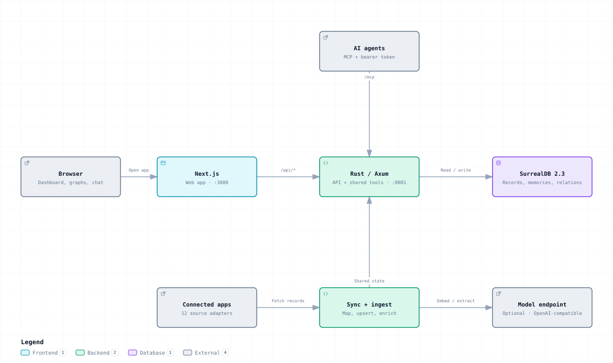
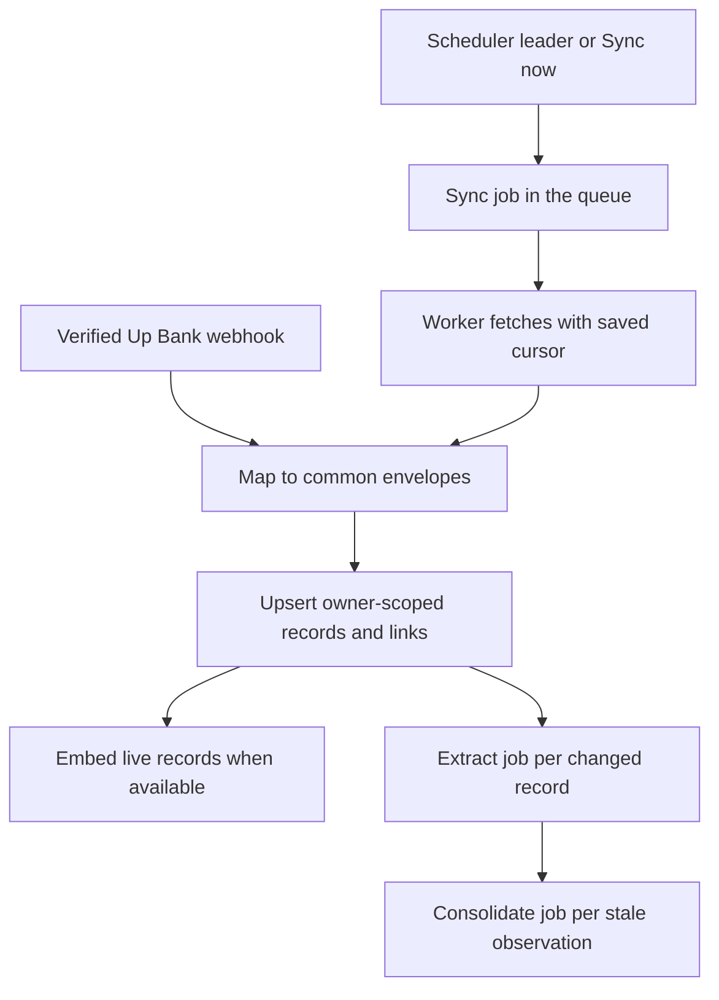
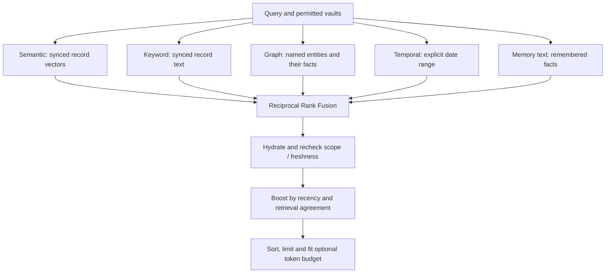
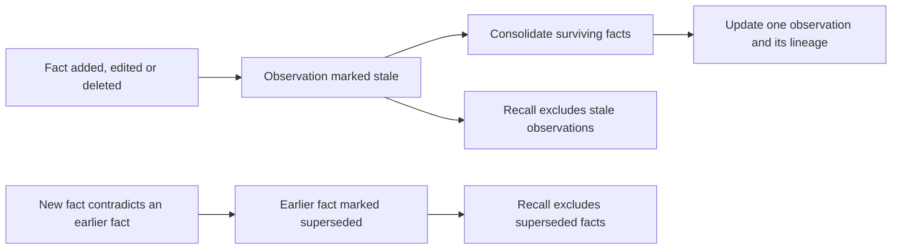

# How Eunomia works

Vaults are Eunomia's core memory boundary. Each vault contains its own
entities, facts, observations and relationships, with access checked against
active membership. Agents use one tool registry to work in these vaults and
recall their knowledge alongside the caller's own synced app records. The
architecture below describes the 2.0 implementation in this repository; the
design notes behind it are in [architecture/](architecture/foundation-plan.md).

[Interactive version](diagrams/architecture.html) — download and open the
HTML locally to explore components, switch themes and export the diagram.

## Vaults define the memory boundary

Every user has a personal vault. Project/team vaults use kind `org`, with
owner and member roles. Active membership is checked on reads and writes;
a pending invitation gives no access. Relations and entity merges stay
inside their vault.

By default, `recall`, `reflect` and `entities_search` read the caller's personal
vault plus the org vaults they belong to. Another user's personal vault must
be requested explicitly, even when shared. Other tools default to the caller's
personal vault. Raw connector records remain owner-scoped, so vault membership
does not grant access to another user's synced records.

Vault names resolve only among the caller's accessible vaults. An entity's
name is unique per kind within its vault, so the same name in another vault
represents a separate entity. Entity relations and merges cannot cross that
boundary.

Cloning copies entities, memories and relations into a new vault owned by the
caller. Merging also creates a new vault: matching entity kinds and names are
folded together, aliases are combined, and duplicate facts and relations are
removed. Both input vaults retain their contents. Memberships are not copied
into the new vault; sharing it is a separate decision.

Vaults live inside an org, and each org has its own database (see the next
section). Invitations look up the invitee's email within the inviter's org.

Sources: [membership, default scopes, clone and merge](../backend/src/vaults/service.rs),
[vault name resolution](../backend/src/tools/registry/mod.rs),
[vault isolation tests](../frontend/tests/vault-isolation.spec.ts).

## Each org has its own database

SurrealDB 3.3 holds one `control` database plus one `org_<id>` database per
org in the same namespace. `control` holds accounts, memberships, sessions,
tokens, OAuth grants, the audit trail, the job queue, failure capsules and the
routing table that maps each org to its database. Everything an org owns
(vaults, entities, memories, synced records, connectors, chat, settings)
lives in its own database, which is created `STRICT`.

The backend reaches an org's database only through a pool that signs in as
that org's own database user, so a query cannot see another org's data even
if an application filter is missing. Owner and vault filters remain as a
second layer inside the org. Only the provisioning code signs in as root, per
operation: to create the control database, create an org, migrate one or move
an older install.

Every SurrealQL statement is a named constant in `store/`, typed by the
database it runs in, so the compiler rejects a tenant statement on the control
database and vice versa. Schema changes are versioned migrations with a
checksum ledger, one set for `control` and one for org databases. A
self-hosted 1.x install is moved into a single org on its first 2.0 boot,
with per-table row counts verified before the org is served.

Sources: [tenancy design and isolation proof](architecture/tenancy.md),
[database handles and pool](../backend/src/pool.rs),
[provisioning and the move](../backend/src/provisioning/mod.rs),
[named statements](../backend/src/store/mod.rs),
[migration runner](../backend/src/migrate.rs),
[migrations](../backend/migrations/README.md).

## One backend, several clients

The Next.js frontend proxies `/api/*` and `/mcp` to the Rust/Axum backend.
Browser requests authenticate with a signed session cookie. MCP requests
require a personal access token or an MCP OAuth 2.1 access token; a browser
cookie is not accepted there. REST tool calls can also use bearer tokens.
Tokens carry scopes (`memory:read`, `memory:write`, `vaults:admin`,
`connectors`), can be limited to one vault and can expire. One request gate
authenticates, rate-limits and checks scopes before any handler runs.

REST (`POST /api/tools/:name`), MCP (`/mcp`) and the built-in chat agent
execute the same registered tools. The registry resolves vault names,
checks access, and logs mutating calls. Chat streams its conversation and
tool activity over SSE. MCP is stateless Streamable HTTP: JSON-RPC POST
requests receive JSON replies, with no server-initiated stream.

The same backend image runs as `api`, `worker` or `all` (the default):
`api` serves HTTP, `worker` runs background jobs, and `all` does both in one
container.

Errors leave the backend as RFC 9457 `application/problem+json` with a stable
code and the request's trace id. Logs are JSON, OpenTelemetry export is
optional, and a failed request or tool call leaves a redacted failure capsule
that `eunomia-backend replay <trace_id>` can re-run against a scratch copy.

Sources: [frontend proxy](../frontend/next.config.ts),
[backend assembly](../backend/src/lib.rs),
[process roles](../backend/src/main.rs),
[authentication](../backend/src/auth.rs),
[request gate](../backend/src/gate.rs),
[authorization and token scopes](../backend/src/authz.rs),
[MCP OAuth](../backend/src/oauth/mod.rs),
[tool registry](../backend/src/tools/registry/mod.rs),
[MCP transport](../backend/src/routers/mcp.rs),
[chat loop](../backend/src/chat/service.rs),
[error codes](errors.md), [debugging](debugging.md),
[observability](observability.md).

## From an app record to useful memory

Each source implements a common adapter interface. The registry contains
Up Bank, HeyPocket, GitHub, Slack, Notion, Linear, Gmail, Google Calendar,
Discord, Spotify, Todoist and Stripe. The demo adapter is resolved on demand
and is excluded from scheduled sources.

Background work runs on a durable job queue in the `control` database.
Workers claim jobs in a transaction and hold a lease that they renew while the
handler runs; a crashed worker's lease expires and the job is claimed again,
so handlers are safe to repeat. Failures retry with backoff until a job is
marked dead. One worker at a time holds the scheduler lease and runs
level-triggered reconcilers that queue missing work with idempotency keys:
due syncs, records without embeddings, stale observations and org databases
behind the current schema.

A source syncs when its interval has elapsed. Defaults are 15 minutes, except
HeyPocket at 24 hours; per-user settings can override them. Failed syncs use
backoff. **Sync now** queues a sync job and waits briefly for its result. An
in-process guard and the queue itself prevent overlapping runs for the same
user/source.

The pipeline maps raw data to `Envelope` values and idempotently upserts
`cache_record` rows and `linked_to` relations. Mapping or storage failures
are recorded while the rest of the batch continues; a partially failed run
keeps its cursor for retry. Embeddings and extraction are best-effort
additions to successfully stored records. A live record without an embedding
is retried when replayed unchanged, and the embedding reconciler finds it too.
Each changed record queues an extraction job, which does nothing without a
chat model; consolidation runs as a job for each entity whose observation has
gone stale.

Sources: [adapter contract](../backend/src/sources/base.rs),
[source registry](../backend/src/sources/registry.rs),
[job queue design](architecture/jobs.md),
[job queue](../backend/src/jobs/mod.rs),
[reconcilers](../backend/src/jobs/leader.rs),
[job handlers](../backend/src/jobs/handlers.rs),
[sync scheduling](../backend/src/sources/scheduler.rs),
[ingestion](../backend/src/cache/ingest.rs),
[webhook verification and dispatch](../backend/src/routers/sources.rs).

## What is stored

| Layer | Storage | Meaning |
|---|---|---|
| Synced records | `cache_record`, `linked_to` | Owner-scoped app data, text, payloads, dates, vectors and record links |
| Entities | `person`, `organisation`, `location`, `repository`, `file`, `symbol` | Vault-scoped subjects with names, aliases and summaries |
| Memories | `memory` | Facts (`world`), events (`experience`) and consolidated beliefs (`observation`) |
| Entity relations | `relates_to` | Labelled links such as `works_at`, `imports` or `calls` |
| Org operations | Vault membership, connectors, sync status, settings, chat, audit log | Per-org permissions, encrypted credentials and operational state |
| Control | Users, org memberships, sessions, tokens, OAuth grants, audit events, jobs, failure capsules, org routing | Identity and instance-wide state, kept in the `control` database |

Every row above except Control lives in the org's own database. SurrealDB
holds graph relations, one BM25 `FULLTEXT` index per text field and a cosine
`HNSW` vector index in the same schema; semantic search falls back to an
exact scan of the caller's records when the index returns too few. Compose
pins SurrealDB 3.3.1 and starts it hardened: `--deny-all`, with only RPC,
HTTP and an allow-list of function families re-enabled, and 60-second query
and transaction limits. The embedding index expects 1,536 dimensions; the
embedding service rejects wrong-sized or non-finite vectors.

Code entities are created by agent calls to `code_entity_upsert` and linked
with `code_relate`. The code graph reflects what agents record about a
codebase; it is not an automatic static-analysis index.

Sources: [org schema](../backend/migrations/tenant/0001_baseline.surql),
[vector and full-text indexes](../backend/migrations/tenant/0008_v3_indexes.surql),
[allowed functions](architecture/surreal-functions.md),
[record operations](../backend/src/cache/search.rs),
[embedding validation and cache](../backend/src/embeddings/service.rs),
[entity tools](../backend/src/entities/tools.rs).

## How recall ranks context

The semantic arm runs concurrently with the local database work. The four
database arms execute sequentially to avoid measured database contention.
Every arm has a four-second deadline. Timeouts yield no candidates for that
arm; a semantic provider error also drops only the semantic arm. Other
database errors can still fail the request. Four seconds is an arm deadline,
not a total request deadline.

Semantic and record-keyword searches only include the caller's own records
alongside their personal vault. Memory-text search works across readable
vaults without embeddings. The graph arm finds exact entity names and aliases
from phrases in the query, follows their memories, and includes eligible
source records and linked neighbours. The temporal arm requires an explicit
`time_range`; it does not parse phrases such as “last week”.

Reciprocal Rank Fusion sums `1 / (60 + rank)` across the ranked candidate
lists, with rank starting at 1. Hydration rechecks record ownership and vault scope and excludes stale
observations and superseded facts. Agreement adds 5% for each additional arm
that found the same item. Recency decreases linearly from 1.0 to a floor of
0.5 over 365 days; undated items receive a neutral multiplier. Scores are
normalised relative to the best returned hit. “Proof” here means retrieval
agreement, not independent evidence that a fact is true.

Results retain their IDs, source, date, vault and number of matching arms.
An optional token budget estimates one token per four characters and trims
individual texts; clients can use the ID to fetch full content. There is no
cross-encoder reranking step.

Sources: [recall orchestration and ranking](../backend/src/cache/recall.rs),
[full-text, vector search and RRF](../backend/src/cache/search.rs).

## Keeping memories current

An observation is an evolving synthesis for one entity, with source-memory
lineage, proof count and versioning. Changing raw facts marks that synthesis
stale, and the scheduler queues a consolidation job for it. Consolidation
rebuilds it from surviving facts, and a configured chat model can mark
contradicted earlier facts as superseded, both on `memory_write` and during
consolidation. Those facts
remain inspectable through entity retrieval. Without a chat model,
contradiction detection does not run.

A source tombstone hides the raw record and its record links from retrieval.
Facts previously derived from that record remain independent assertions;
forgetting them requires memory deletion. The explicit “delete source data”
operation also removes facts and relations derived from that source.

Sources: [consolidation](../backend/src/entities/consolidate.rs),
[supersession](../backend/src/entities/supersede.rs),
[memory edits and deletion](../backend/src/entities/service.rs),
[source data deletion](../backend/src/sources/registry.rs).

## Model boundaries

| Capability | Without a server model | With a suitable configured endpoint |
|---|---|---|
| Agent memory writes, vaults and graphs | Available | Available |
| Raw connector sync and text/graph recall | Available with source credentials | Available |
| Semantic record retrieval | Unavailable | Requires an embeddings endpoint with 1,536-dimensional output |
| Automatic entity extraction and consolidation | Unavailable | Requires chat completions |
| `reflect` | Returns recalled context and instructions for the calling agent | Synthesises an answer with citations; falls back to context if synthesis fails |
| In-app chat | Unavailable | Requires chat completions and tool calling |
| Vector cloud | Lexical projection | Can use semantic embeddings |

Model providers are resolved per user. A server API key is used only for its
configured base URL; a user selecting a different URL supplies their own
credentials. Configuring a remote model means relevant record text and
memories can be sent to that endpoint for embedding or synthesis. Connector
secrets and each org's database password use AES-256-GCM at rest under
`ENCRYPTION_KEY`; this does not encrypt every database record. The `backup`
service takes a nightly encrypted export of every database.

Sources: [vault membership and defaults](../backend/src/vaults/service.rs),
[provider resolution](../backend/src/embeddings/provider.rs),
[reflection and fallback](../backend/src/cache/reflect.rs),
[vector cloud](../backend/src/cache/cloud.rs),
[credential encryption](../backend/src/connectors/crypto.rs).

## Where to start in the code

| Question | Entry point |
|---|---|
| How do vault access, cloning and merging work? | [`vaults/service.rs`](../backend/src/vaults/service.rs) |
| How does the server start? | [`main.rs`](../backend/src/main.rs), [`state.rs`](../backend/src/state.rs) |
| How are orgs kept apart? | [`pool.rs`](../backend/src/pool.rs), [`tenancy.md`](architecture/tenancy.md) |
| How is the database defined? | [`migrations/`](../backend/migrations/README.md), [`migrate.rs`](../backend/src/migrate.rs) |
| Where is a query written? | [`store/`](../backend/src/store/mod.rs) |
| How does a tool reach shared logic? | [`tools/registry/mod.rs`](../backend/src/tools/registry/mod.rs) |
| How does background work run? | [`jobs/`](../backend/src/jobs/mod.rs), [`jobs.md`](architecture/jobs.md) |
| How does source data become memory? | [`cache/ingest.rs`](../backend/src/cache/ingest.rs) |
| How does a query find relevant context? | [`cache/recall.rs`](../backend/src/cache/recall.rs) |
| How do clients call the API? | [`openapi.json`](../backend/openapi.json), [`frontend/src/lib/gen/`](../frontend/src/lib/gen/sdk.gen.ts), [`frontend/src/lib/api.ts`](../frontend/src/lib/api.ts) |
| How is vault isolation exercised? | [`vault-isolation.spec.ts`](../frontend/tests/vault-isolation.spec.ts) |
| How is org isolation proved? | [`isolation.rs`](../backend/tests/isolation.rs) |
| How is retrieval evaluated? | [`recall-eval.spec.ts`](../frontend/tests/recall-eval.spec.ts) |

For operational setup, use [Deployment](deployment.md); for the 1.x to 2.0
database upgrade, use [Upgrading to SurrealDB 3](upgrading-to-surrealdb-3.md).
For the user-facing memory model and edge cases, use [Concepts](concepts.md).
For every test layer, use [Testing](testing.md).
